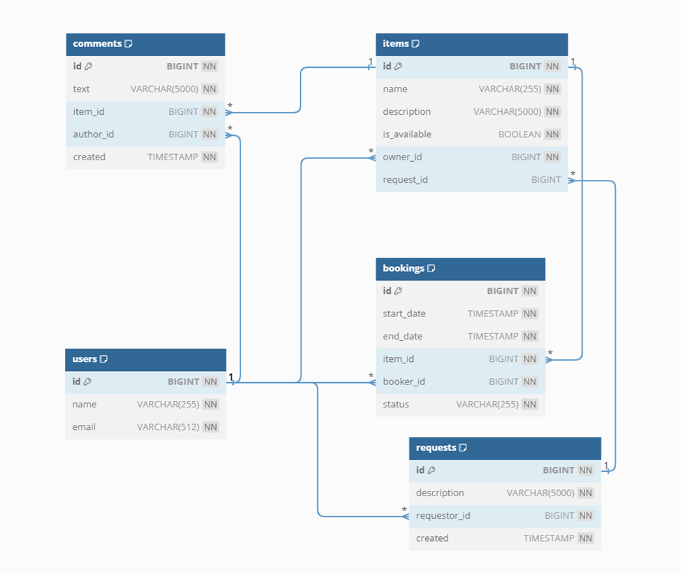

<h1 align="center"> ShareIt </h1>

____
**ShareIt** - сервис для шеринга (от англ. *share* — «делиться») вещей. 

Шеринг как экономика совместного использования набирает сейчас всё большую полярность. 
Если в 2014 году глобальный рынок шеринга оценивался всего в *$15* млрд, то к 2025 может достигнуть *$335* млрд.

Данный проект дает пользователям возможность рассказывать, какими вещами они готовы поделиться, находить нужную вещь и брать её в аренду на какое-то время. 

Сервис не только позволяет бронировать вещь на определённые даты, но и закрывает к ней доступ на время бронирования от других желающих. 
На случай, если нужной вещи на сервисе нет, у пользователей есть возможность оставлять запросы. По запросу можно будет добавлять новые вещи для шеринга.
___
### Технологический стек проекта:
- Java 11
- Spring Boot
- Apache Maven
- Hibernate
- Lombok
- PostgreSQL
- Docker
- JUnit
- Mockito

Валидация данных в приложении осуществлялась при помощи аннотаций из пакета *javax.validation* для полей DTO-классов, параметров методов контроллеров. 
Также реализована логика групповой валидации при помощи аннотации `@Validated` и маркерных интерфейсов для обеспечения проверки различных групп полей DTO объектов в зависимости от вызываемого эндпоинта.
___
### Приложение состоит из двух модулей:
1.	*Шлюз (gateway)* - часть приложения, с которой непосредственно работают пользователи. В нём выполняется вся валидация запросов. 
Этот микросервис является легковесным, поскольку для него не требуется база данных и каких-то особых ресурсов. 
При необходимости его получится легко масштабировать, чтобы справиться с потоком запросов от пользователей.
2.	*Основной модуль* – микросервис, содержащий основную логику обработки запросов и взаимодействующий с базой данных.

Межсервисное взаимодействие реализовано через стандартный HTTP клиент (`RestTemplate`).
____
### Предметная область приложения представлена следующими сущностями:
- Пользователь (`User`) – владелец вещи или лицо, осуществляющее бронирование / запрос на необходимую вещь.
- Вещь (`Item`) – предмет бронирования или запроса.
- Комментарий (`Comment`) – комментарий к вещи. Могут оставлять только пользователи, бравшие вещь в аренду.
- Бронирование (`Booking`) – сущность, отвечающая за аренду вещи определенным пользователем на конкретные даты.
- Запрос (`ItemRequest`) - пользователь создаёт такой запрос, когда не может найти нужную вещь, воспользовавшись поиском, 
но при этом надеется, что у кого-то она всё же имеется. Другие пользователи могут просматривать подобные запросы и добавлять нужную вещь в ответ на запрос.

#### *Схема базы данных основного сервиса*

___
Данный проект полностью покрыт *модульными* и *интеграционными* тестами. Также было реализовано несколько тестов для тестовых 
слайсов: веб-слоя, компонентов JPA и сериализации JSON.

Также тестирование приложения проводилось при помощи *Postman* – коллекции, расположенной в папке postman проекта.
